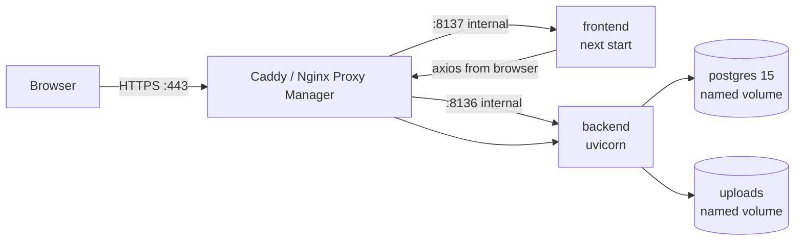

# Production Deployment Guide

Deploy **JobApplicationTracker** on a VPS in production. For local
development with hot-reload, see the Quick Start in
[readme.md](readme.md) instead.

---

## 1. Overview

The production stack runs on Docker Engine + Docker Compose plugin:

| Service  | Base image            | Port     |
|----------|-----------------------|----------|
| db       | postgres:15           | internal only (no public port) |
| backend  | python:3.11-slim      | 8136     |
| frontend | node:20-alpine (multi-stage) | 8137 |

Key design points:

- **Data survives everything** — the database and uploaded files live in
  named Docker volumes (`pgdata`, `uploads`). Rebuilds and upgrades never
  touch them; only `docker compose down -v` deletes them.
- **Secrets never in the repo** — all configuration comes from one
  `deploy/.env.prod` file on the server.
- **Upgrades are in-place** — the distribution zip ships only `.example`
  templates, so your live `docker-compose.prod.yml` and `.env.prod` are
  never overwritten by an upgrade.

---

## 2. Prerequisites

- Any VPS: 2 vCPU / 2 GB RAM / 20 GB disk minimum (Ubuntu 24.04 recommended)
- Docker Engine + Docker Compose plugin installed
- A domain name pointing at the server (for HTTPS via a reverse proxy)
- Open ports: 80/443 (web), 22 (SSH) — nothing else needs to be public

### Architecture



The frontend calls the API **from the browser** (axios), so the reverse
proxy must route one domain to both services (e.g. `yourdomain.com` →
frontend, `yourdomain.com/api` → backend).

---

## 3. Build the distribution zip

On your dev machine (Windows PowerShell), from the repo root:

```powershell
cd distribution
./create-distribution.ps1
```

Output: `distribution/jobtracker-distribution-v{version}.zip` containing:

```
backend/                      # app code + Dockerfile.prod
frontend/                     # source + Dockerfile.prod
docker-compose.prod.example.yml
deploy/.env.prod.example
```

No build artifacts, no git history, no secrets.

---

## 4. First install

SFTP the zip to the server, then:

```bash
unzip jobtracker-distribution-v1.1.6.zip -d /docker/jobtracker
cd /docker/jobtracker
ls -la              # confirm docker-compose.prod.example.yml is present
ls -la deploy/      # confirm .env.prod.example is present
```

Create the compose file and env file (first install only):

```bash
cp -n docker-compose.prod.example.yml docker-compose.prod.yml
cp -n deploy/.env.prod.example deploy/.env.prod
```

Fill in real secrets:

```bash
openssl rand -base64 32   # paste into POSTGRES_PASSWORD
openssl rand -base64 48   # paste into JWT_SECRET
nano deploy/.env.prod
```

Reference `.env.prod`:

```
POSTGRES_USER=jobtracker
POSTGRES_PASSWORD=<strong-random>
POSTGRES_DB=job_tracker
JWT_SECRET=<random-48-bytes>
GEMINI_API_KEY=<your-gemini-key>
GEMINI_MODEL=gemini-3.6-flash
DEBUG=false
FRONTEND_URL=https://yourdomain.com
ALLOWED_ORIGINS=["https://yourdomain.com"]
NEXT_PUBLIC_API_URL=https://yourdomain.com
# API docs (Swagger UI at /docs) are disabled by default in production.
# Set true to enable (then add the /docs proxy routes - see section 6).
SHOW_API_DOCS=false
```

Build and start the stack:

```bash
docker compose --env-file deploy/.env.prod -f docker-compose.prod.yml up -d --build
```

Watch it come up:

```bash
docker compose --env-file deploy/.env.prod -f docker-compose.prod.yml logs -f
```

You want to see:
- Postgres: `database system is ready to accept connections`
- Backend: `Application startup complete`
- Frontend: `Ready`

Press Ctrl+C to exit the log view, open `https://yourdomain.com`, and
register your account — **the first registered user becomes admin**.

> `NEXT_PUBLIC_API_URL` is read at **build time** by Next.js and inlined
> into the JS bundle. Passing `--env-file deploy/.env.prod` to docker compose
> makes that value available both to the frontend image build args and the
> runtime environment.

---

## 5. Upgrades (in-place)

No fresh folder needed. Upload the new zip and unzip over the existing
install — only application files are replaced:

```bash
cd /docker/jobtracker
unzip -o jobtracker-distribution-v1.1.6.zip
docker compose --env-file deploy/.env.prod -f docker-compose.prod.yml up -d --build
```

Preserved on every upgrade:
- `docker-compose.prod.yml` (your customized copy)
- `deploy/.env.prod` (secrets)
- `pgdata` and `uploads` volumes (all data)
---

## 6. Reverse proxy + HTTPS

The compose file exposes ports 8136/8137 on all interfaces so a reverse
proxy (Nginx Proxy Manager, Caddy, or nginx) on the same host can reach
them via the Docker bridge gateway `172.17.0.1`.

Example nginx server block:

```nginx
server {
    listen 443 ssl http2;
    server_name yourdomain.com;

    # SSL certs configured as usual (certbot / NPM / existing setup)

    location /api/ {
        proxy_pass http://172.17.0.1:8136;   # backend container via Docker bridge
        proxy_set_header Host $host;
        proxy_set_header X-Real-IP $remote_addr;
        proxy_set_header X-Forwarded-For $proxy_add_x_forwarded_for;
        proxy_set_header X-Forwarded-Proto $scheme;
    }


    location / {
        proxy_pass http://172.17.0.1:8137;   # frontend container via Docker bridge
        proxy_set_header Host $host;
        proxy_set_header X-Forwarded-Proto $scheme;
    }
}
```

HTTPS is non-negotiable since login credentials and JWTs travel over the
wire.

> **API docs are disabled by default in production.** FastAPI's `/docs`,
> `/redoc`, and `/openapi.json` are turned off unless `SHOW_API_DOCS=true`
> is set in `deploy/.env.prod` — they expose the full API surface
> (including admin endpoints) and should stay off on a live site. If you
> do enable them, add the three `location =` blocks above for `/docs`,
> `/redoc`, and `/openapi.json`, routing to the backend.

---

## 7. Firewall

Because the compose file exposes 8136/8137 on all interfaces, block direct
internet access to them. Only the reverse proxy (on the same host) should
reach the app:

```bash
sudo ufw deny 8136/tcp
sudo ufw deny 8137/tcp
sudo ufw allow from 127.0.0.1 to any port 8136 proto tcp
sudo ufw allow from 127.0.0.1 to any port 8137 proto tcp
sudo ufw reload
```

If the proxy runs in a container, Docker's userland proxy routes
container-to-host traffic through localhost, so the `127.0.0.1` rules work.
If your setup blocks that, allow the bridge subnet (e.g. `172.17.0.0/16`)
instead.

---

## 8. Backups

**Cron (daily) — database dump:**

```bash
docker compose --env-file deploy/.env.prod -f docker-compose.prod.yml exec -T db pg_dump -U jobtracker job_tracker > backup_$(date +%F).sql
```

**Also back up** the `uploads` volume. Test a restore before you need it.

**In-app options:**
- Every user: **Data → Export Backup** (their own data + files)
- Admin only: **Data → System Backup** (ALL users' data + all uploaded
  files, one zip) and **System Restore** (replaces everything)

---

## 9. Troubleshooting

### `failed to prepare extraction snapshot ... parent snapshot ... does not exist: not found`

Seen during `docker compose ... up -d --build` while exporting the backend
image. This is **not** an app problem — the Docker BuildKit layer cache on
the server is corrupted. Check disk space first: `df -h`.

**Fix 1 — scoped to this app only (preferred if the server hosts other
Docker projects):**

```bash
cd /docker/jobtracker
docker compose -f docker-compose.prod.yml down
docker rmi jobtracker-backend:latest jobtracker-frontend:latest
docker compose --env-file deploy/.env.prod -f docker-compose.prod.yml up -d --build --no-cache
```

**Fix 2 — clear the global build cache** (other projects' containers,
images, and volumes are untouched; only their cache is removed, so their
next rebuilds are slower):

```bash
docker builder prune -af
docker compose --env-file deploy/.env.prod -f docker-compose.prod.yml up -d --build
```

**Fix 3 — restart the Docker daemon** (clears in-flight snapshot state,
but briefly stops ALL containers on the host):

```bash
sudo systemctl restart docker
```

> Avoid `docker system prune -a` on a shared host — it removes unused
> images from every project, not just this one.

### "I rebuilt and my data is gone?"

It isn't. `up -d --build` only recreates containers. All data lives in the
`pgdata` (Postgres) and `uploads` volumes. Only `docker compose down -v`
or `docker volume rm` deletes them. To double-check:

```bash
docker compose --env-file deploy/.env.prod -f docker-compose.prod.yml exec -T db pg_dump -U jobtracker job_tracker | head -20
```

### Ports already in use

If 8136 or 8137 are taken on the host, edit your `docker-compose.prod.yml`
(ports are under your control — that is why the file is yours, not
shipped in the zip).

---

## 10. Common production commands

```bash
# Follow logs (all services)
docker compose --env-file deploy/.env.prod -f docker-compose.prod.yml logs -f

# Restart one service
docker compose --env-file deploy/.env.prod -f docker-compose.prod.yml restart backend

# Rebuild one service
docker compose --env-file deploy/.env.prod -f docker-compose.prod.yml up -d --build backend

# Stop the stack (volumes kept)
docker compose --env-file deploy/.env.prod -f docker-compose.prod.yml down

# Stop AND delete all data (fresh start — irreversible)
docker compose --env-file deploy/.env.prod -f docker-compose.prod.yml down -v
```

---

## 11. Local development

This guide is for production only. For local development (dev compose with
hot-reload, first-time login, common dev commands) see the **Development**
section of [readme.md](readme.md).